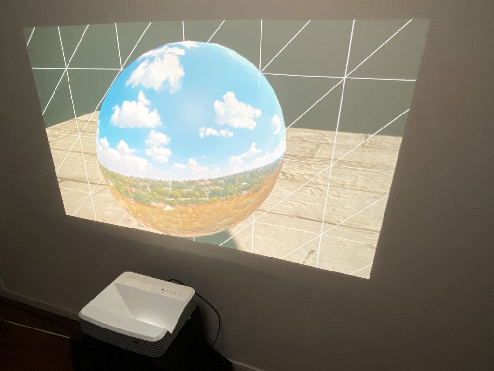
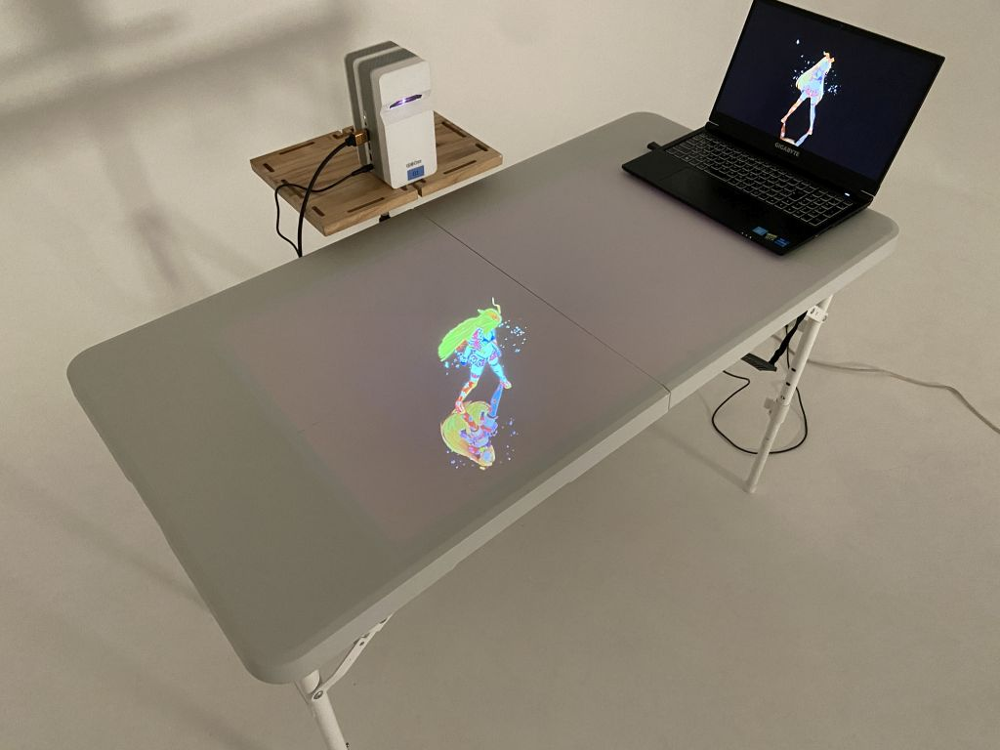
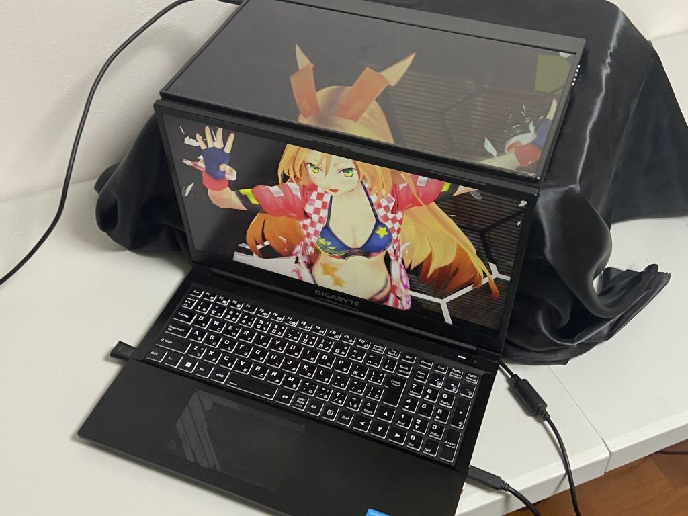

# What's Portalgraph?

日本語は[こちら](https://app.gitbook.com/s/aJCTlOkQcgkhVMLcuHBm/)

Portalgraph is a Unity software development environment for enjoying VR spaces on projectors and PC screens. Because the image changes in response to the user's movements, you can experience a space that truly seems to exist inside the screen — allowing you to look into that space in 3D from any position: up, down, left, right, near, or far.

<figure><figcaption>
Portalgraph application
</figcaption></figure>

In addition to standard projector screens, Portalgraph can also display VR spaces projected onto a tabletop, across a box constructed from multiple displays arranged together, on ceilings, and more.

<figure><figcaption>
Desktop Portalgraph
</figcaption></figure>

<figure><figcaption>
Portalgraph with a Box Made from Two Combined LCD Displays
</figcaption></figure>

Developers can easily build such demos using Unity.

<figure><figcaption></figcaption></figure>

The communication protocol between the tracking application and the Portalgraph core is publicly available, so you can implement your own custom tracking application if desired.

#### Get Started Here

For those who want to experience Portalgraph


[turn-your-pc-screen-into-a-vr-space.md](quick-start/turn-your-pc-screen-into-a-vr-space.md)



[turn-a-3d-projector-into-a-vr-space.md](quick-start/turn-a-3d-projector-into-a-vr-space.md)


For those who want to build a Portalgraph app


[portalgraph-app-creation-tutorial.md](quick-start-developper/portalgraph-app-creation-tutorial.md)


Portalgraph detects the user's viewpoint in real time and generates 3D imagery rendered to that viewpoint. This makes it appear as though a space exists inside the screen, which you can peer into. Viewpoint detection is performed either via face recognition through a webcam or by attaching a VIVE Tracker to the head. It supports left-right split, top-bottom split, anaglyph, and dual left-right output modes, making it compatible with 3D projectors, 3D televisions, anaglyph glasses, and other 3D display devices.

The Portalgraph runtime is implemented as software independent from the Portalgraph application itself, tracking the user's viewpoint and sending coordinates to the application via OSC. It currently supports face tracking via webcam and tracking via VIVE Tracker.

