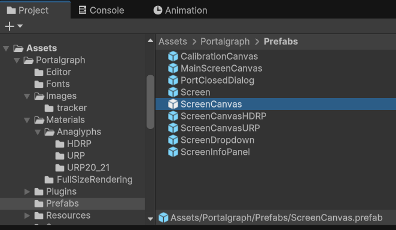
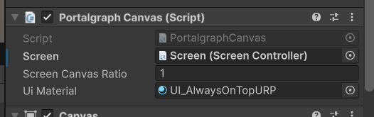

# UI Creation

This page explains how to display UI in Portalgraph. Portalgraph provides UI that is always displayed at the same size on screen regardless of world scale, renders correctly in left-right and top-bottom split 3D, and supports mouse and touch input.

When displaying UI in Portalgraph, use the following prefabs according to your rendering pipeline instead of a standard Canvas:

* **Built-in** — `Assets/Portalgraph/Prefab/ScreenCanvas`
* **URP** — `Assets/Portalgraph/Prefab/ScreenCanvasURP`
* **HDRP** — `Assets/Portalgraph/Prefab/ScreenCanvasHDRP`

<figure><figcaption></figcaption></figure>

After placing the prefab in the scene, set **Portalgraph/Screens/Screen** from the Portalgraph prefab in your scene to the **Screen** field of the **PortalgraphCanvas** component. The UI will then be displayed at full size on that screen.

<figure><figcaption></figcaption></figure>

<figure><figcaption></figcaption></figure>

Use **TextMesh Pro** for any text labels. Because this Canvas is in world space, objects in front of it may occlude the labels. To prevent this, set the font asset's shader to **TextMeshPro/Mobile/Distance Field Overlay**.

<figure><figcaption></figcaption></figure>

<figure><figcaption></figcaption></figure>

Portalgraph UI supports both mouse and touch input. With mouse input, the clickable area is the left half of the screen in left-right split 3D mode, or the top half in top-bottom split 3D mode. With touch input, the entire screen is touchable regardless of 3D mode, and clicks register at the visually correct position.

To switch between mouse and touch input, open the settings screen by pressing **F12** while the Portalgraph application is running, then go to **"Next" → "Input"** and select either **Mouse** or **Touch**.

<figure><figcaption></figcaption></figure>
