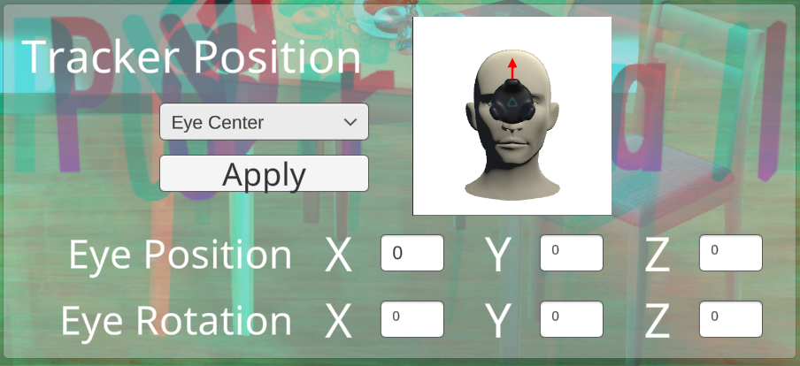

# Camera Tracking Setup Guide

## Portalgraph Settings

Run the application created with Portalgraph and open the settings menu (usually by pressing F12). The settings screen has two tabs, **Camera** and **Tracker** — select the **Camera** tab to track with a webcam.\
(The screenshots below are from the version before the tab split; the steps have been rewritten for the current Camera tab.)

<figure><figcaption></figcaption></figure>

If you are using a built-in webcam positioned just above a standard 16:9 monitor, enter the screen size (in inches) on the Camera tab — that's all you need to do (it takes effect automatically once you move focus out of the field). Tracker App Auto Start and the tracker position (equivalent to **EyeCenter**) are also configured automatically at this point, so there's no need to set those separately.

<figure><figcaption></figcaption></figure>

<figure><figcaption></figcaption></figure>

<figure><figcaption></figcaption></figure>

If this is not the case, check **Advanced Mode**, then manually enter the screen size and specify the camera’s coordinates and angles. For the XYZ axes, positive directions are upward, to the right, and foward, respectively, relative to the screen. The same Camera tab also lets you switch the 3D display mode (Anaglyph, Side-By-Side, etc.), though Anaglyph is fine for most setups.

<figure><figcaption></figcaption></figure>

## Camera tracking Application Setting

The camera tracking app is pre-configured for a standard built-in PC webcam, so if you are using an internal camera, simply select the camera and click **Apply** to complete the setup.

<figure><figcaption></figcaption></figure>

If you are using a specialized camera, click **Calibration** to start a countdown. During this countdown, use a measuring tool to position your face so that your eyes are exactly 50 cm in front of the camera. Once the countdown finishes, the camera’s field of view and focal length will be adjusted accordingly.

<figure><figcaption></figcaption></figure>

Here are some tips to enhance your experience:

* **Lower Camera Resolution:** Set the camera resolution lower to reduce CPU load (640×360 is sufficient).
* **High-FPS Camera:** A high-FPS camera improves responsiveness.
* **Wide-Angle Camera:** A wide-angle camera allows for more movement within the frame but may introduce distortion towards the edges of the field of view.
* **Recommended Camera:** The developer uses a camera with a 120-degree field of view and 60fps.
* **Check Camera Specs:** You can verify the camera’s supported resolution and FPS in the Windows Camera app under "Video Settings."
