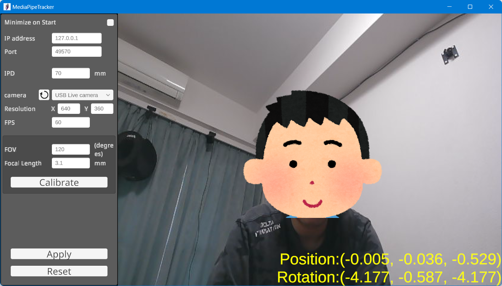
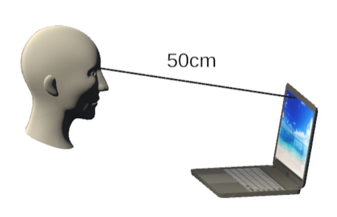

# Portalgraph App Creation Tutorial

This page is intended for developers and explains how to create the simplest possible Portalgraph app. It covers how to use your PC's built-in camera or an external USB webcam and view the result with anaglyph (red-blue) 3D glasses.

Portalgraph is capable of displaying content using a single binary regardless of the combination of hardware used — whether that is a 3D projector, 3D television, or standard monitor with red-blue glasses, and whether tracking is done via camera or VIVE Tracker. This tutorial covers the standard monitor + red-blue glasses + camera tracking setup, but apps you create will also work in other configurations.

### Requirements

* A PC with a webcam capable of running Unity (with a GPU, or an Intel Core series CPU from within the past five years or equivalent)
* Portalgraph runtime installed: [https://portalgraph.itch.io/portalgraph-runtime](https://portalgraph.itch.io/portalgraph-runtime)
* Portalgraph Personal [https://portalgraph.itch.io/portalgraph-personal](https://portalgraph.itch.io/portalgraph-personal)
* Unity 6 or later
* Red-blue 3D glasses

## Asset Usage

#### Creating a Project

If you have not already done so, create a new project from Unity Hub. Select **Universal 3D** as the template (Built-in and HDRP are also supported).

<figure><figcaption></figcaption></figure>

## **Importing Assets**

### Importing Portalgraph asset

From the menu, go to **Assets → Import Package → Custom Package**, select **portalgraph.unitypackage**, and import the assets into the project.

### Setting TextMesh Pro

Import the Essential Resources for TextMesh Pro. From the menu, go to **Window → TextMeshPro → Import TMP Essential Resources** and click to import.

<figure><figcaption></figcaption></figure>

## Anaglyph Configuration for URP

Anaglyph renderer configuration is required when using URP. Please refer to the instructions below to set it up.


[urp-anaglyph-renderer.md](../developer-docs/urp-anaglyph-renderer.md)


## Creating the Scene

Create a scene in Unity and place the Portalgraph prefab from the Project window at coordinates **(0, 0, 0)**. Place **Assets/Portalgraph/PortalgraphURP\_2023-6** into the scene. The coordinates of **Portalgraph/ScreenCenter** will serve as the center point of the display screen.

<figure><figcaption></figcaption></figure>

**※ The prefab to use varies depending on your Unity version and rendering pipeline:**

* **Built-in:** Portalgraph
* **URP with Unity 2022 or earlier:** PortalgraphURP\_2020-22
* **URP with Unity 2023 or 6+:** PortalgraphURP\_2023-6
* **HDRP:** PortalgraphHDRP

<figure><figcaption></figcaption></figure>

Also, delete the Main Camera that was originally in the scene, as it is no longer needed.

<figure><figcaption></figcaption></figure>

Place a Cube at coordinates **(0, 0, 0)** with a size of **(0.1, 0.1, 0.1)**. ※ In Portalgraph, objects appear in the real world at the size you specify in Unity. Since displayed objects must be smaller than your PC screen, set the size to **(0.1, 0.1, 0.1)**.

<figure><figcaption></figcaption></figure>

### **Building**

Click **File → Build Settings** from the menu.

<figure><figcaption></figcaption></figure>

In the **Scene List** tab, click **Add Open Scenes** to add the current scene to **Scenes in Build**, then go to the **Windows** tab and click **Build**.

<figure><figcaption></figcaption></figure>

<figure><figcaption></figcaption></figure>

Click 'Add Open Scenes' to add the current scene to 'Scenes in Build', and then click 'Build' to build.

<figure><figcaption>
Click 'Add Open Scenes' to add the current scene to 'Scenes in Build', and then click 'Build'.
</figcaption></figure>

## Running

Running a Portalgraph application requires the Portalgraph runtime to be installed. After installing the runtime, run the output executable and the camera tracking app will launch automatically.

<figure><figcaption></figcaption></figure>

Select the webcam to use from the camera dropdown and click **"Apply"** to begin tracking your face position. Click **"Calibrate"** to start a countdown — position yourself so that your eyes are 50 cm directly in front of the camera and wait for the values to be set automatically.

<figure><figcaption></figcaption></figure>

Return to the screen of the app you created. If this is your first time running Portalgraph, the settings screen will appear automatically on the **Camera** tab. (If it does not appear, press F12 and select the **Camera** tab.) Enter the screen size, press **OK**, and close the settings screen.

<figure><figcaption></figcaption></figure>

<figure><figcaption></figcaption></figure>

You now have a Portalgraph application that can be viewed in 3D from any angle. Put on your anaglyph (red-blue) 3D glasses and enjoy the experience.

**Controls:**

* **W A S D R F** — Move forward/back/left/right/up/down (hold Shift for slow movement)
* **Q E T G Z C** — Rotate left/right, up/down, and tilt (hold Ctrl to rotate in 90° increments)
* **1 2** — Change scale (hold Shift to slow down)
* **3** — Reset scale

Adjust the camera position, angle, and scale to suit the size and orientation of your screen.

***

**Troubleshooting**

**If the camera tracking app does not work**, install the latest VC++ Runtime: [https://learn.microsoft.com/en-us/cpp/windows/latest-supported-vc-redist?view=msvc-170](https://learn.microsoft.com/en-us/cpp/windows/latest-supported-vc-redist?view=msvc-170)

**If nothing is displayed:** Is the Cube placed in the scene set to a size of **(0.1, 0.1, 0.1)**? Portalgraph displays objects at their actual size, so anything larger than the screen cannot be displayed. Try pressing the **1** key to reduce the scale.
