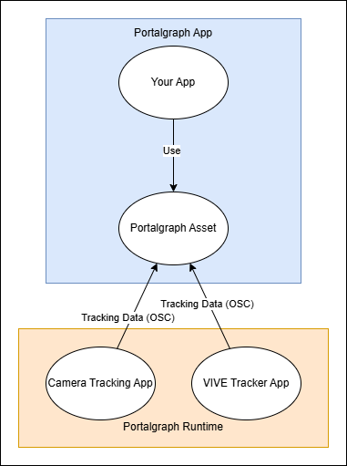

# Portalgraphとは

[English documents is here.](https://app.gitbook.com/s/R4jDeJrvuIogaygztZi7/)

Portalgraphは、プロジェクターやPC画面でVR空間を楽しむUnity用ソフトウェア開発環境です。ユーザーの動きに合わせて映像が変化することで、スクリーンの中に本当に空間が存在し、上下左右遠近、自由な位置から3Dでその空間を覗き込む体験ができます。

<figure><figcaption>
Portalgraphの利用例
</figcaption></figure>

また、一般的なプロジェクタースクリーンだけでなく、机の上に投影したり、複数のディスプレイを張り合わせた箱や天井等にもVR空間を表示することができます。

<figure><figcaption>
机に投影されたPortalgraph
</figcaption></figure>

<figure><figcaption>
２つの液晶ディスプレイを組み合わせた箱でのPortalgraph
</figcaption></figure>

開発者はUnityで容易にこのようなデモを構築可能となっています。

### まずはこちらからスタート

Portalgraphを体験したい人向け


[anatanopcwovrnishitemiyou.md](quick-start/anatanopcwovrnishitemiyou.md)



[3dpurojekutwovrnishitemiyou.md](quick-start/3dpurojekutwovrnishitemiyou.md)


Portalgraphアプリを作ってみたい人向け


[Broken link](/broken/pages/MdlNPgidi9qTZbGvNmdV)


Portalgraphはリアルタイムでユーザーの視点を検出し、その視点に合わせた映像を3Dで生成し表示します。\
これにより、スクリーンの中に空間が存在するように見え、覗き込むことができます。\
視点の検出はWebカメラによる顔認識か、VIVEトラッカーを頭部に装着することで行います。\
左右分割、上下分割、アナグリフ、左右2系統出力の3D出力が可能で、3Dプロジェクター、3Dテレビ、アナグリフ等の3D映像装置に対応します。

Porltagraphランタイムは、ユーザーの視点を追跡する、Portalgraphアプリケーション本体から独立したソフトウェアとして実装され、OSC経由でアプリケーションに座標を送信します。現在はWebカメラによるフェイストラッキングとVIVEトラッカーによるトラッキングに対応しています。

<figure><figcaption></figcaption></figure>

トラッキングアプリとPortalgraph本体の通信プロトコルは公開されているので、ご自身で独自のトラッキングアプリを実装することも可能です。
