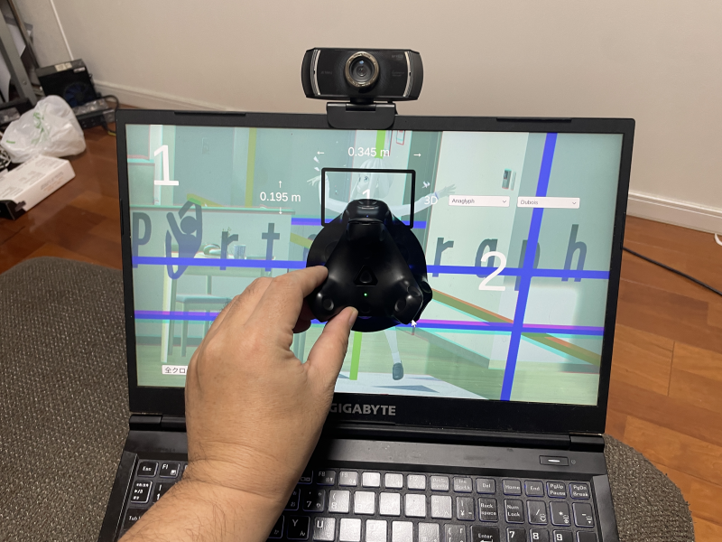

# VIVEトラッカー設定ガイド

## Portalgraph設定

Portalgraphで制作されたアプリケーションを実行して設定画面を開き（標準ではF12キーで開く）、トラッカーアプリ自動起動にチェックし、その下のドロップダウンからOpenVRを選択すると、次回起動時に自動でVIVEトラッカー用トラッキングソフトが起動します。

<figure><figcaption></figcaption></figure>

#### 初回設定

VIVEトラッカー用トラッキングソフトの初回起動時に以下のように設定の修正を促すメッセージが表示されます。VIVEトラッカーは標準でVRヘッドセットとセットで使うように設定されているため、VRヘッドセット無しで使用するための設定の変更が必要になります。「修正する」をクリックした後、画面のメッセージに従って、SteamVRを終了して、再度VIVEトラッカー用トラッキングソフトを起動してください（スタートメニューにTracker Portalgraphという名前で登録されています）。

<figure><figcaption></figcaption></figure>

トラッカー位置のドロップダウンで「Forehead」を選択し、「適用」をクリックすると、額にトラッカーを装着するよう設定されます（取り付け予定位置に合わせて選択してください）。

<figure><figcaption></figcaption></figure>

<figure><figcaption></figcaption></figure>

「次へ」をクリックし、「トラッカー」をクリックする。

.png>)

トラッカー設定画面で画面サイズをメートル単位で入力し、キャリブレーションをクリックして、画面中央にトラッカーを合わせてカウントダウンを待つとキャリブレーションされます。

<figure><figcaption></figcaption></figure>

<figure><figcaption></figcaption></figure>

以上
