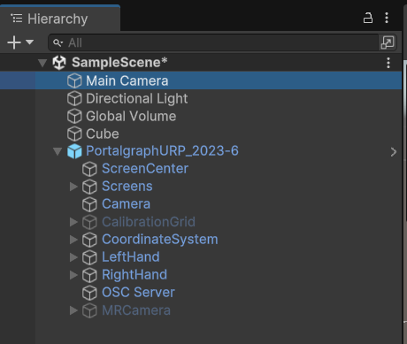

# Portalgraphアプリ作成チュートリアル

このページでは、開発者向けに最もシンプルなPortalgraphアプリの作成方法を解説します。PCの内蔵カメラ、または外付けUSBカメラを使い、アナグリフ（赤青）3Dメガネで見る方法を解説します。

Portalgraphは3Dプロジェクター/3Dテレビ/通常モニター＋赤青メガネ、カメラトラッキング/VIVEトラッカー等の違いを問わず、同一のバイナリで表示することが可能です。今回は通常モニター＋赤青メガネとカメラトラッキングで解説しますが、作成されたアプリは他の環境でも動作可能です。

### 必要なもの

* Webカメラ付きでUnityが動くPC（GPU搭載、または過去5年以内のIntel Coreシリーズ程度のCPU）
* Portalgraphランタイムのインストール [https://portalgraph.booth.pm/items/6256749](https://portalgraph.booth.pm/items/6256749)
* Unity 6以降
* 赤青3Dメガネ\
  &#x20;[https://www.stereoeye.jp/shop/index.html](http://toy-box.shop-pro.jp/?pid=4563970) (推奨)\
  &#x20;[https://amzn.asia/d/438qF7P](https://amzn.asia/d/438qF7P)

## アセット使用手順

### プロジェクトの作成

まだ作成してない場合は、Unity Hubから新規プロジェクトを作成します。テンプレートはUniversal 3Dを選択してください（Build-in、HDRPも使用可能）。

<figure><figcaption></figcaption></figure>

### アセットのインポート

### Portalgraphアセットのインポート

メニューのAssets→Import Packages→Custom Packageからportalgraph.unitypackageを選択して、プロジェクトにアセットをインポートする。

<figure><figcaption></figcaption></figure>

#### TextMesh Pro設定

TextMesh ProのEssential Resourcesをインポートする。メニューのWindow→TextMeshPro→Import TMP Essential Resourcesをクリックしてインポートする。

<figure><figcaption></figcaption></figure>

### URP使用時のアナグリフ設定

URP使用時のみ、アナグリフ用レンダラーの設定が必要です。以下を参考に設定してください。


[urp-anaglyph-renderer.md](../developer-docs/urp-anaglyph-renderer.md)


### シーンの作成

Unity上でシーンを作成し、座標(0,0,0)にProject内のPortalgraphのプレハブを配置します。**Assets/Portalgraph/PortalgraphURP\_2023-6**をシーン内に配置してください。Portalgraph/ScreenCenterの座標が、表示画面の中心点になります。

<figure><figcaption></figcaption></figure>

※配置するプレハブは、Unityのバージョン、レンダリングパイプラインによって異なります。

* Build-inの場合……Portalgraph
* URPでUnity 2022以前の場合……PortalgraphURP\_2020-22
* URPでUnity 2023、6以降の場合……PortalgraphURP\_2023-6
* HDRPの場合……PortalgraphHDRP

.png>)

**また、元からシーンにあったMain Cameraは不要ですので、削除してください。**

<figure><figcaption></figcaption></figure>

座標(0,0,0)に**サイズが(0.1, 0.1, 0.1)のCube**を配置します。\
※PortalgraphではUnity上で入力したサイズで物体が現実に見えます。ですので、表示する物体はあなたのPC画面より小さい必要があるため、サイズを(0.1, 0.1, 0.1)にします。

<figure><figcaption></figcaption></figure>

### ビルド

メニューのFile→Build Settingsをクリックします。

<figure><figcaption></figcaption></figure>

Sceme ListタブでAdd Open Scenesをクリックして現在のシーンをScenes in Buildに追加し、WindowsタブでBuildをクリックしてビルドします。

<figure><figcaption></figcaption></figure>

<figure><figcaption></figcaption></figure>

### 実行

Portalgraphアプリケーションの実行にはPortalgraphランタイムのインストールが必要です。\
ランタイムのインストール後に出力された実行ファイルを実行すると、自動でカメラトラッキングアプリが起動します。

<figure><figcaption></figcaption></figure>

カメラドロップダウンから使用するWebカメラを選択し、「適用」をクリックすれば顔の座標を追跡します。\
キャリブレーションをクリックするとカウントダウンが始まるので、カメラ真正面50cmの場所に目が来るように待機すれば自動で数値が設定されます。

<figure><figcaption></figcaption></figure>

作成したアプリの画面に戻ると、初めてPortalgraphを実行する場合は、自動で設定画面が「カメラ」タブの状態で表示されるので（初めてではない場合はF12を押して「カメラ」タブを選択）、画面サイズを入力してOKを押して、設定画面を閉じます。

<figure><figcaption></figcaption></figure>

<figure><figcaption></figcaption></figure>

以上で、様々な角度から3Dで見ることが出来るPortalgraphアプリケーションが出来ます。アナグリフ（赤青）3Dメガネを掛けて体験を楽しんでください。

操作は、\
\
WASDRF…前後左右上下移動（Shiftと同時押しで低速移動）\
QE TG ZC…左右、上下、傾き回転（Ctrlと同時押しで90度回転）\
12…スケール変更（Shiftと同時押しで低速化）\
3…スケールリセット

画面のサイズ、傾きに合わせてちょうどいいカメラ位置、角度、スケールに合わせてください。

#### うまく動かないときのチェックポイント

* カメラトラッキングアプリが動かない場合は、最新版のVC++ランタイムをインストールしてください。 https://learn.microsoft.com/en-us/cpp/windows/latest-supported-vc-redist?view=msvc-170
* 何も表示されない場合\
  画面に配置したCubeのサイズは(0.1, 0.1, 0.1)になっていますか？Portalgraphは実際のサイズで表示するので、画面より大きい物体は表示できません。1キーを押すとスケールが縮小されるので、試してみてください。

