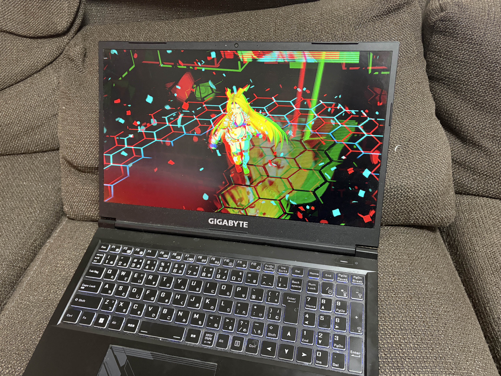
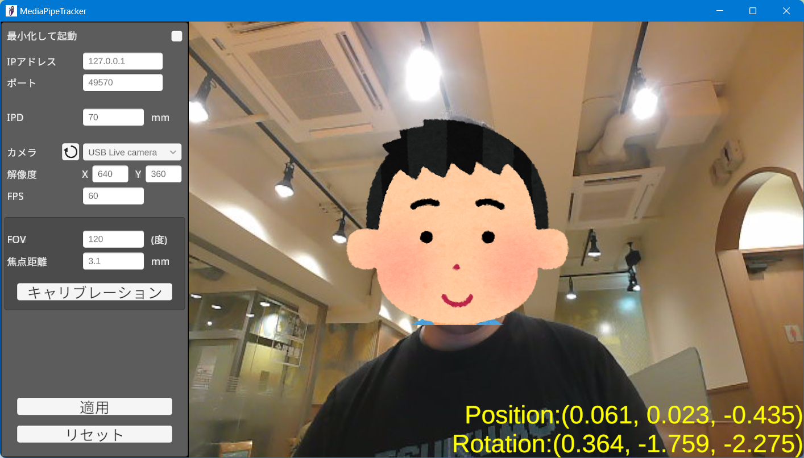

# あなたのPC画面をVR空間にしてみよう

このページでは、無料配布されているユニティちゃんライブステージ！for Portalgraphを使ってユーザーに既存のPortalgraphアプリで遊ぶ方法を解説します。一般的なPCモニターと、Webカメラによる支店トラッキングと、アナグリフ（赤青）メガネで画面の中にVR空間が現れるような体験ができます。PC画面は最大30インチ以下で、画面から1m以内で見ることを想定しています。

Portalgraphは画面の大きさ、位置とユーザーの視点を元に映像を生成します。そのため、システムに画面サイズとカメラの見え方を把握させるキャリブレーションが必要になるので、その方法を解説します。

<figure><figcaption></figcaption></figure>

## 必要なもの

Windows 10以降のPC（GPU搭載、またはIntel Coreシリーズ第10世代以降か同等のCPU）\
Webカメラ\
アナグリフ（赤青）3Dメガネ\
&#x20;　[https://www.stereoeye.jp/shop/index.html](http://toy-box.shop-pro.jp/?pid=4563970) (推奨)\
&#x20;　[https://amzn.asia/d/438qF7P](https://amzn.asia/d/438qF7P)

## 使用方法

Portalgraphランタイムがインストールされてない場合は、事前にインストールします。\
[https://portalgraph.booth.pm/items/6256749](https://portalgraph.booth.pm/items/6256749)

次に、ユニティちゃんライブステージ！ for Portalgraphをダウンロードし、解凍し、UnityChan CRS.exeをダブルクリックして実行します。\
[ユニティちゃんライブステージ！ for Portalgraph](https://portalgraph.booth.pm/items/3234733)

<figure><figcaption></figcaption></figure>

カメラトラッキングアプリが自動で起動するので、カメラを選択して「適用」をクリックし、ユニティちゃんライブステージのウインドウに戻ります。

<figure><figcaption></figcaption></figure>

#### ※もしもカメラ映像が表示されない場合は

カメラトラッキングアプリとユニティちゃんライブステージを終了し、VC++ランタイムをインストールして起動し直してください。\
[https://learn.microsoft.com/en-us/cpp/windows/latest-supported-vc-redist?view=msvc-170](https://learn.microsoft.com/en-us/cpp/windows/latest-supported-vc-redist?view=msvc-170)

### キャリブレーション

Portalgraphは動作するのに画面の大きさと座標が必要なので、キャリブレーションでシステムに入力します。

Portalgraphアプリケーションの初回起動時はカメラトラッキングのキャリブレーション画面が表示されます（表示されない場合は、F12キーを押して設定画面を表示し、「次へ」→「カメラ」をクリックしてください）。

<figure><figcaption></figcaption></figure>

画面サイズを入力します。

<figure><figcaption></figcaption></figure>

「閉じる」をクリックすると画面の中にユニティちゃんが現れるので、アナグリフ（赤青）メガネをかけると自由な角度からユニティちゃんが動いてるのが3Dで見られます。

<figure><figcaption></figcaption></figure>

Portalgraphアプリケーションは標準で以下のキー操作が出来ます。

WASDRF…前後左右上下移動（Shiftと同時押しで低速移動）\
QE TG ZC…左右、上下、傾き回転（Ctrlと同時押しで90度回転）\
12…スケール変更\
3…スケールリセット

画面のサイズ、傾きに合わせてちょうどいいカメラ位置、角度、スケールに合わせてください。

### ※映像が歪んでる場合は

#### カメラの調整

カメラトラッキングアプリは、標準で一般的なWebカメラの視野角（FOV）に合わせて調整されていますが、もしも大きく異なるFOVのカメラを使用している場合はカメラトラッキングアプリをキャリブレーションをしてください。

<figure><figcaption></figcaption></figure>

キャリブレーションをクリックするとカウントダウンが始まるので、カメラ真正面50cmの場所に目が来るように待機すれば自動で数値が設定されます。

<figure><figcaption></figcaption></figure>

#### 正確な画面サイズの入力

もしもあなたのPCが一般的な16:9の画面ではなかったり、カメラが画面中央のすぐ上に無い場合は、正しく映像が表示されないので、ユニティちゃんライブステージ！アプリで以下を設定してください。

ユニティちゃんライブステージのウインドウでF12キーを押すと設定画面が開かれます。

<figure><figcaption></figcaption></figure>

「次へ」をクリックします。

<figure><figcaption></figcaption></figure>

「カメラ」をクリックすると、カメラトラッキングのキャリブレーション画面が開かれます。

<figure><figcaption></figcaption></figure>

「上級モード」をチェックします。

<figure><figcaption></figcaption></figure>

使用しているモニターのサイズを計測し、画面サイズにメートル単位で入力します。\
カメラ位置はドロップダウンで画面に対するカメラの位置を上下左右中央（Top, Bottom, Left, Right, Center）から選択し、そこに対する座標をメートル単位で入力します。XYZはそれぞれ、画面に向かって右、上、奥方向が正方向になります。\
カメラ角度はカメラが画面に対して垂直でない場合に入力してください（通常は変更する必要はありません）。

入力して「OK」→「閉じる」をクリックすると正しく見えるはずです。

